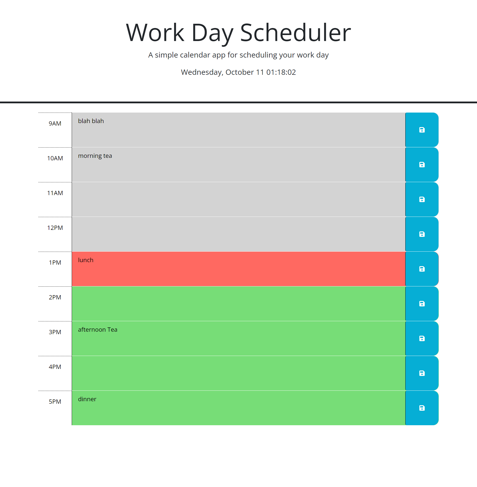

# 05 Third-Party APIs: Work Day Scheduler

## Date

* Current Date is displayed at the top of the screen

## Single Day Work Scheduler

* Time blocks for each hour from 9 am through 5pm
* * Each block is titled with time
* * Each block has input section where you can add items when clicked
* * Each block has a save button that will save the data when clicked
* Time blocks are updated with:
* * Past time block is Gray
* * Current time block is Red
* * Future time block is Green
* Upon refreshing of the page any data saved persists

## Screenshot

* 

## Deployed Page

* https://napoleondd86.github.io/day-planner/

